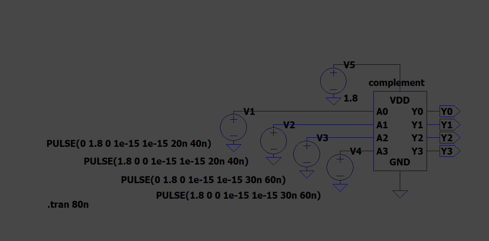
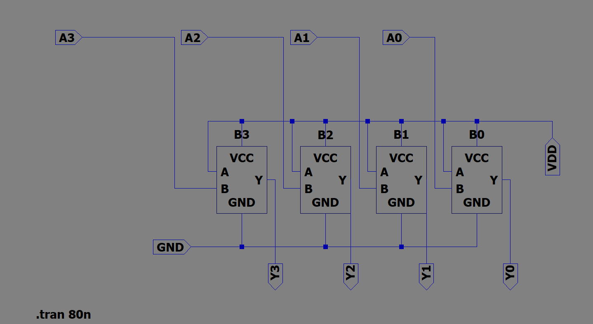

# 4-bit 1's Complement Circuit using LTspice

## 📖 Overview

This project presents the design and simulation of a **4-bit 1's Complement Circuit** using **CMOS transistor-level implementation** in LTspice. The circuit performs bitwise inversion of a 4-bit binary input and verifies the output through transient simulation.

---

## 🎯 Objective

- Design a CMOS-based XOR gate.
- Build a 4-bit 1's Complement combinational logic circuit.
- Verify the circuit using transient analysis in LTspice.

---

## 🛠️ Tools Used

- LTspice
- CMOS Logic Design

---

## ⚙️ Working Principle

Each input bit is XORed with a logic HIGH (1). This operation inverts every input bit, producing the 1's complement of the 4-bit binary input.

---

## 📸 Project Screenshots

### XOR CMOS Schematic

---

### 4-bit 1's Complement Circuit

---

### Circuit Symbol

---

### Simulation Result

---

## ✅ Result

The simulation confirms that the circuit correctly generates the 1's complement of the applied 4-bit input.

---

## 📚 Applications

- Digital Logic Design
- Arithmetic Logic Units (ALUs)
- VLSI Design
- Digital Electronics Education

---

## 👩‍💻 Author

**Satya Harshini**
